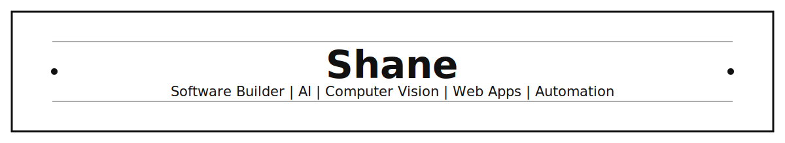

Taiwan · NCNU · GitHub: `shanewu0907`

## Tech Stack

  
  
  
  
  
  
  
  
  
  
  
  
  
  
  
  
  

## About

Hi, I'm Shane. I build practical software projects across AI, computer vision, automation, Discord bots, and web applications.

My work focuses on turning experiments into usable tools, with attention to real-time workflows, desktop interfaces, persistent data, and deployment-ready project structure.

I also use AI-assisted development tools such as ChatGPT, Codex, and Claude for prototyping, debugging, code review, and workflow acceleration.

## Focus Areas

- AI-assisted software development and automation workflows
- YOLO Pose human keypoint detection and stick-figure visualization
- Real-time screen capture, video analysis, and screenshot-based positioning
- PyQt desktop tools for model selection, capture preview, and experiment control
- MediaPipe Hands 21-point hand landmark detection
- HSV color tracking for comparison and rule-based detection workflows
- LocateAnything image grounding for screenshot and local image positioning
- Discord bot systems with commands, persistent data, scheduled jobs, and game logic
- Web applications with modern frontend, realtime data, and deployment-oriented structure

## Featured Work

### YoloPU

A computer vision experiment project for reading video or real-time screen input, detecting human keypoints with YOLO Pose, and displaying posture as a stick-figure skeleton.

Key parts:

- YOLO Pose workflow for human keypoint detection
- Real-time screen capture and video analysis
- PyQt UI for capture preview, model selection, and experiment control
- MediaPipe Hands 21-point hand landmark detection
- HSV color tracking as a non-AI comparison workflow
- LocateAnything screenshot and local image positioning
- Demo flow for dataset generation, training, detection, center-point conversion, and click-result reporting

### ColorWeb

A Next.js, TypeScript, and Supabase color memory game platform.

Key parts:

- Solo mode, multiplayer rooms, daily challenges, and leaderboards
- Supabase Postgres and Realtime-backed persistence
- Tailwind CSS, Zustand, React Hook Form, and Framer Motion
- Docker and self-hosted deployment notes for Linux server environments

### Discord Bot Projects

Node.js and Python Discord bot projects focused on automation, persistent data, scheduled jobs, utility features, and testable game logic.

Key parts:

- Discord command handling and bot workflows
- SQLite, JSON, and CSV data persistence
- Slot/game logic, cooldowns, scheduled jobs, and backup scripts
- Image, QR, and media utility workflows

[Invite Bot](https://discord.com/oauth2/authorize?client_id=1380141443355639808&permissions=2147608640&integration_type=0&scope=bot+applications.commands)

## Public Repositories

- [`qrcodepro`](https://github.com/shanewu0907/qrcodepro): QR code project
- [`motrix-expansion`](https://github.com/shanewu0907/motrix-expansion): Browser extension for sending downloads to Motrix / aria2

## GitHub Stats

## Contact

- GitHub: [@shanewu0907](https://github.com/shanewu0907)
- Discord: `shane0907` / `Shane#8787`
